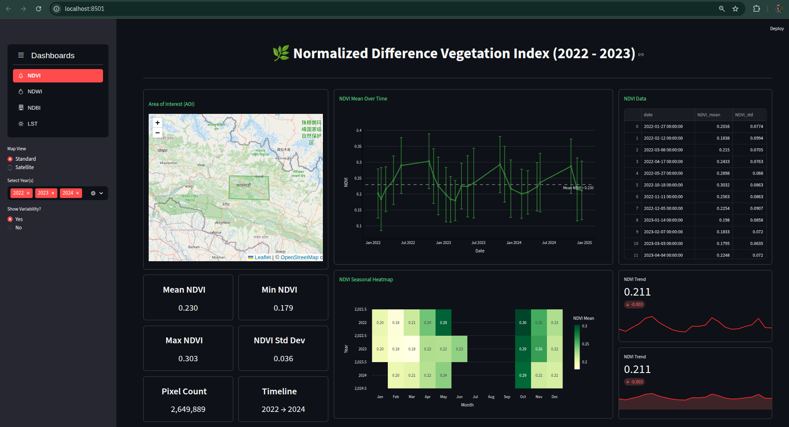
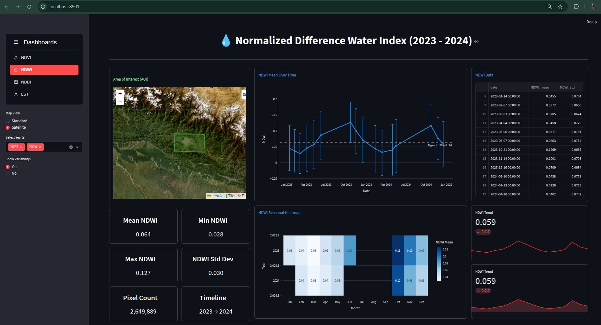
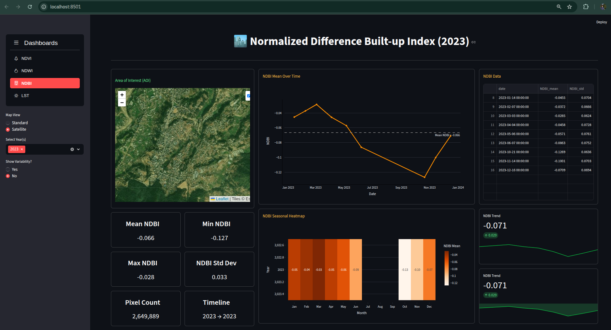
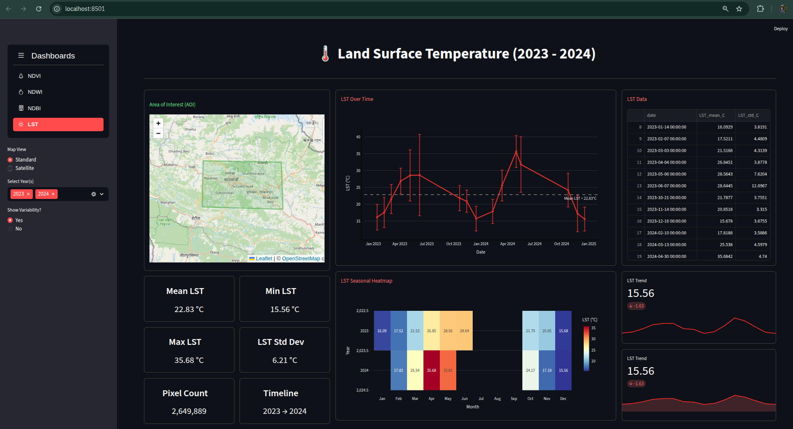

## 🛰️ LandScape Insight : NDVI, NDWI, NDBI & LST Monitoring

> A geospatial analytics project that uses **Landsat satellite imagery from USGS** to analyze **vegetation health (NDVI)**, **water content (NDWI)**, **built-up areas (NDBI)**, and **land surface temperature (LST)** trends over time.  

> This system detects **environmental changes** (e.g., greenness loss, urban expansion, warming trends) and provides **interactive dashboards** for visualization and exploration.

---

### 📌 Project Overview

> This project is part of the **Mach24 Orbitals Technical Assessment (GIS & AI)**.  
> It focuses on analyzing **natural and urban environments** using freely available **Landsat imagery (USGS)** and modern geospatial processing tools.

#### 📸 Homepage Screenshot



#### ✨ Core Features

- ✅ **NDVI Computation** – Detect vegetation greenness trends using Red & NIR bands.  
- 💧 **NDWI Computation** – Monitor water content and seasonal variations using NIR & SWIR bands.  
- 🏙 **NDBI Computation** – Identify built-up areas using SWIR & NIR bands.  
- 🌡 **LST Analysis** – Monitor land surface temperature changes using thermal bands.  
- 📊 **Time Series & Trend Detection** – Monthly & yearly analysis of changes for all indices.  
- 🗺 **Interactive Dashboard** – Streamlit app with maps, charts, metrics, and summary statistics.  
- 🟢 **AOI Mapping** – Visualize Areas of Interest with selectable basemaps (OSM / Satellite).  
- 📈 **Seasonal Heatmaps** – NDVI, NDWI, NDBI, and LST heatmaps for trend analysis.  

---

## 🛠️ Technology Stack

| Category | Tools |
|-----------|-------|
| **Programming** | Python 3.9+ |
| **Framework** | Streamlit |
| **Data Analysis** | Pandas, NumPy |
| **Geospatial** | GeoPandas, Folium |
| **Visualization** | Plotly, Altair, Matplotlib |
| **Data Source** | USGS Landsat 8/9 Collection 2 |
| **Environment** | Virtualenv / venv |

---

### 🖼️ Dashboard Screenshots

Here are some snapshots of the interactive dashboards:

| NDVI Dashboard Overview | NDWI Dashboard Overview |
|---------------------|---------------|
|  |  |

| NDBI Dashboard Overview | LST Dashboard Overview |
|---------------------|---------------|
|  |  |

---

## 🧭 How to Run the Project ?

Follow these steps to set up and launch the **LandScape Insight Dashboard** locally:

### **1. Clone the Repository**

```bash
git clone https://github.com/SiddhuShkya/Mach24-Orbital-Project.git
cd Mach24-Orbital-Project
```

### **2. Create a Virtual Environment**

```bash
python3 -m venv venv
source venv/bin/activate     # On Windows: venv\Scripts\activate
```

### **3. Install Dependencies**

```bash
pip install -r requirements.txt
```

### **4. Go inside /src Directory**

```bash
cd src
```

### **5. Run the Dashboard**

```bash
streamlit run main.py
```

### **6. Access the Dashboard**

```bash
http://localhost:8501/
```

> You’ll see the full dashboard with tabs for NDVI, NDWI, NDBI, and LST — each with charts, maps, and insights.

---

## 🙌 Acknowledgements

- **`USGS Earth Explorer`**  → For providing Landsat 8/9 satellite data.
- **`Mach24 Orbitals`**  → For the GIS & AI technical assessment framework.
- **`Streamlit Community`**  → For enabling interactive data visualization.