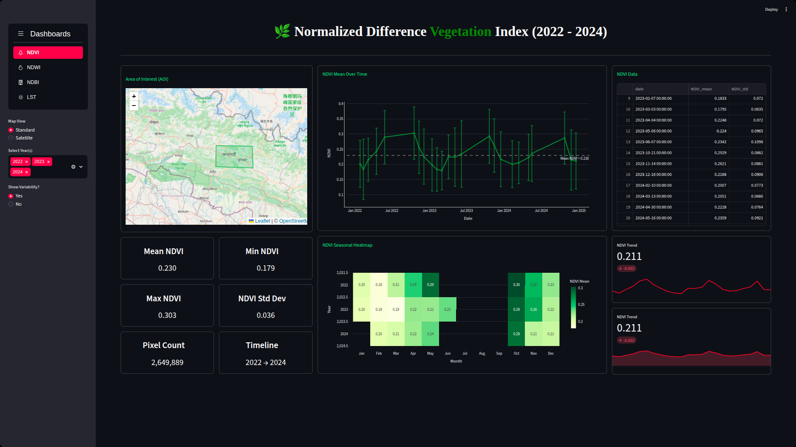
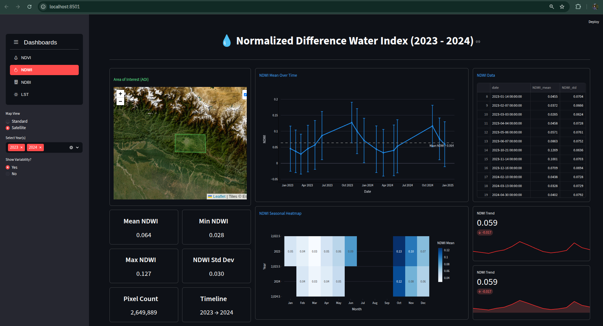
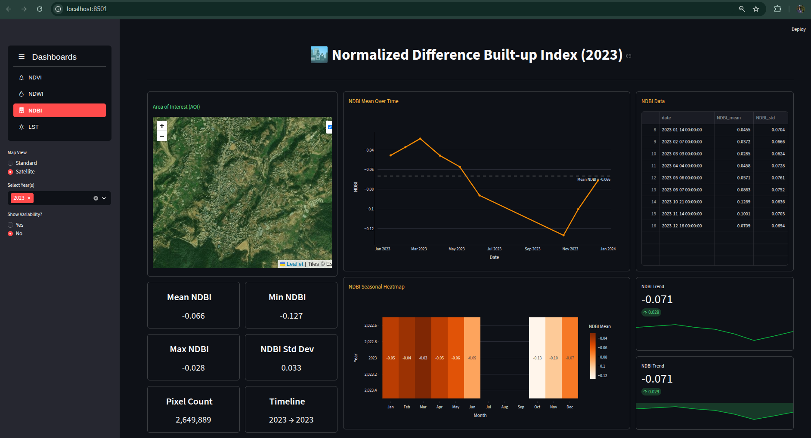
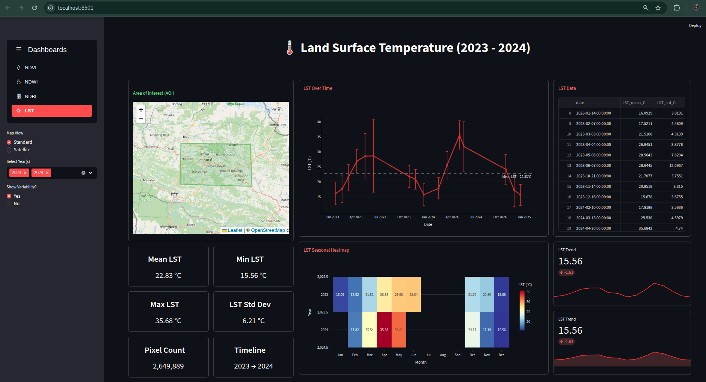

## 🛰️ Mach24-Orbital-Project : NDVI, NDWI, NDBI & LST Monitoring

> A geospatial analytics project that uses **Landsat satellite imagery from USGS** to analyze **vegetation health (NDVI)**, **water content (NDWI)**, **built-up areas (NDBI)**, and **land surface temperature (LST)** trends over time. This system detects **environmental changes** (e.g., greenness loss, urban expansion, warming trends) and provides **interactive dashboards** for visualization and exploration.

---

### 📌 What It Does

> The project analyzes satellite data to track environmental changes by computing four key indices:

#### 🌿 **NDVI (Normalized Difference Vegetation Index)**
- Measures vegetation health and greenness
- Uses Red and Near-Infrared (NIR) bands
- Detects vegetation loss or growth trends

#### 💧 **NDWI (Normalized Difference Water Index)**
- Monitors water content and seasonal variations
- Uses NIR and Short-Wave Infrared (SWIR) bands
- Tracks water body changes over time

#### 🏙️ **NDBI (Normalized Difference Built-up Index)**
- Identifies urban development and built-up areas
- Uses SWIR and NIR bands
- Detects urban expansion patterns

#### 🌡️ **LST (Land Surface Temperature)**
- Analyzes land surface temperature changes
- Uses thermal bands from Landsat
- Monitors warming trends and heat patterns

--- 

## 📸 Homepage Screenshot



--- 

## 🛠️ Technology Stack

| Category | Tools |
|-----------|-------|
| **Programming** | Python 3.9+ |
| **Framework** | Streamlit |
| **Data Analysis** | Pandas, NumPy |
| **Geospatial** | GeoPandas, Folium |
| **Visualization** | Plotly, Altair, Matplotlib |
| **Data Source** | USGS Landsat 8/9 Collection 2 |
| **Environment** | Virtualenv / venv |

---

## 🔥 Key Features

- ✅ **Multi-Index Analysis** – NDVI, NDWI, NDBI, and LST computation
- 📊 **Time Series Analysis** – Monthly and yearly trend detection (2022-2024)
- 🗺️ **Interactive Maps** – Folium-based maps with standard and satellite views
- 📈 **Data Visualization** – Charts, heatmaps, and correlation plots
- 🎯 **AOI Mapping** – Customizable Area of Interest visualization
- 🔄 **Year Filtering** – Multi-select year filtering for comparative analysis
- 📉 **Variability Toggle** – Show/hide data variability in visualizations

---

## 📂 Repo Structure

```
📂 Mach24-Orbital-Project/
├── 📂 data
│   ├── 📂 2022        # Contains Landsat band files (.TIF)
│   ├── 📂 2023        # Contains Landsat band files (.TIF)
│   ├── 📂 2024        # Contains selected processed data
│   ├── 📄 all-landsat-data.csv   # Combined dataset for all years
│   └── 📄 aoi.geojson            # Area of Interest polygon
├── 📂 docs
│   ├── 📄 data-source.md          # Info about data sources (USGS, AOI, etc.)
│   └── 📄 task.md                 # Description of project tasks/workflow
├── 📂 images
│   ├── 📂 AOI                     # AOI maps
│   ├── 📂 COMBINED_PLOTS          # Correlation plots
│   ├── 📂 LST_PLOTS               # Land Surface Temperature plots
│   ├── 📂 NDBI_PLOTS              # Built-up index plots
│   ├── 📂 NDVI_PLOTS              # Vegetation index plots
│   ├── 📂 NDWI_PLOTS              # Water index plots
│   ├── 📂 SCREENSHOTS             # Screenshots of intermediate results
│   └── 📂 USGS                    # USGS platform screenshots
├── 📂 notebooks
│   ├── 📂 Data-Analysis
│   │   ├── 📄 Land-Surface-Temperature.ipynb       # LST analysis
│   │   ├── 📄 Normalized-Difference-Builtup-Index.ipynb  # NDBI analysis
│   │   ├── 📄 Normalized-Difference-Vegetation-Index.ipynb  # NDVI analysis
│   │   └── 📄 Normalized-Difference-Water-Index.ipynb      # NDWI analysis
│   ├── 📄 Data-Extraction.ipynb    # Data extraction workflows
│   ├── 📄 Data-Understanding.ipynb # Exploratory data analysis
│   └── 📄 Data-Visualization.ipynb # Plotting and visual insights
├── 📄 README.md                    # Project overview
├── 📄 requirements.txt             # Python dependencies
└── 📂 src
    ├── 📂 Dashboards
    │   ├── 📄 lst_dashboard.py    # LST dashboard
    │   ├── 📄 ndbi_dashboard.py   # NDBI dashboard
    │   ├── 📄 ndvi_dashboard.py   # NDVI dashboard
    │   └── 📄 ndwi_dashboard.py   # NDWI dashboard
    ├── 📄 data_loader.py          # Code to load and preprocess data
    └── 📄 main.py                 # Main application entry
```

---

### 🖼️ Dashboard Screenshots

Here are some snapshots of the interactive dashboards:

| NDVI Dashboard Overview | NDWI Dashboard Overview |
|---------------------|---------------|
|  |  |

| NDBI Dashboard Overview | LST Dashboard Overview |
|---------------------|---------------|
|  |  |

---

## 🧭 How to Run the Project ?

Follow these steps to set up and launch the **LandScape Insight Dashboard** locally:

### **1. Clone the Repository**

```bash
git clone https://github.com/SiddhuShkya/Mach24-Orbital-Project.git
cd Mach24-Orbital-Project
```

### **2. Create a Virtual Environment**

```bash
python3 -m venv venv
source venv/bin/activate     # On Windows: venv\Scripts\activate
```

### **3. Install Dependencies**

```bash
pip install -r requirements.txt
```

### **4. Run the Dashboard**

```bash
streamlit run src/main.py
```

### **5. Access the Dashboard**

```bash
http://localhost:8501/
```

> You’ll see the full dashboard with tabs for NDVI, NDWI, NDBI, and LST — each with charts, maps, and insights.

---

## 🐳 Run with Docker (Alternative Method)

### **1. Build the Docker Image**

```bash
sudo docker build -t mach24-orbital-project .
```

### **2. Run the Docker Container**

```bash
sudo docker run -p 8501:8501 mach24-orbital-project
```

### **3. Access the Dashboard**

```bash
http://0.0.0.0:8501/
```

> The Streamlit app will start automatically inside the Docker container and serve on port 8501.

---

## 🙌 Acknowledgements

- **`USGS Earth Explorer`**  → For providing Landsat 8/9 satellite data.
- **`Mach24 Orbitals`**  → For the GIS & AI technical assessment framework.
- **`Streamlit Community`**  → For enabling interactive data visualization.

---

## 👨🏻‍💻 Author

Siddhartha Shakya