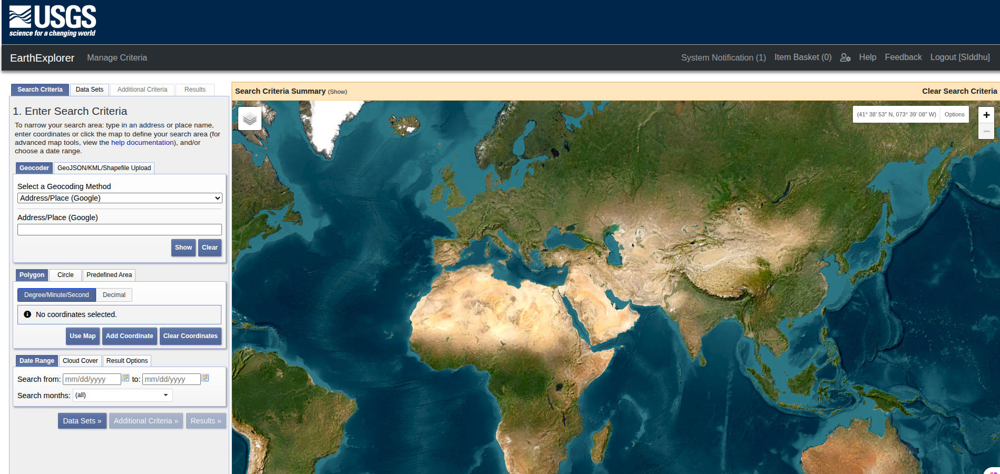
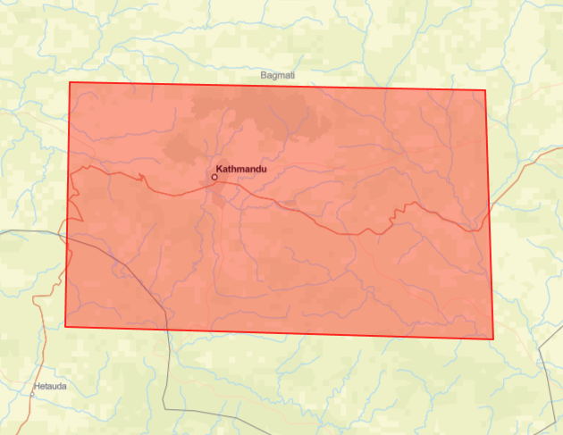
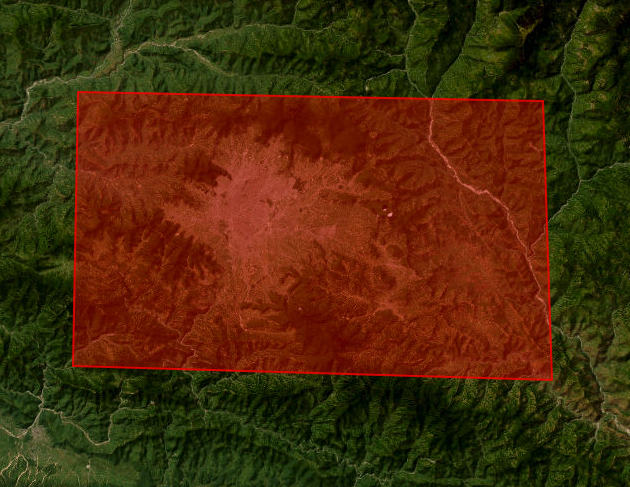

## 🛰️ Data Source/Dircetory

> The satellite imagery used in this project was collected from the **[USGS Earth Explorer](https://earthexplorer.usgs.gov/)** platform.  

**Screenshot:**




> Specifically, **Landsat 8/9 Collection 2** data was downloaded for the selected **Area of Interest (AOI)**. The following bands were used:

---

## 📍 AOI (Area of Interest)

> Our AOI polygon covers a large region in central Nepal, primarily encompassing the Kathmandu Valley and its surrounding districts. Geographically, it spans from roughly 85.08°E to 85.74°E longitude and 27.49°N to 27.84°N latitude, which includes the cities of Kathmandu, Lalitpur, and Bhaktapur etc. This area represents a diverse landscape—ranging from dense urban settlements in the valley floor to agricultural fields, forested hills and natural environmental dynamics (vegetation, surface temperature variation) over time.

| ESRI Vector Map | ESRI World Imagery | 
|:---------------:|:------------------:|
|  |  | 

---

## 💾 Acquisition Details

- **Timeline:** 2022 – 2024  
- **Cloud Cover Range:** 0 – 15%  
- **Bands Used:**
  - **B4** – Red  
  - **B5** – Near Infrared (NIR)  
  - **B6 / B7** – Shortwave Infrared (SWIR, for NDBI and NDWI computation)  
  - **B10 / B11** – Thermal Infrared (for **Land Surface Temperature (LST)** computation)  
- **MTL Metadata:** Included for accurate calibration during LST computation.

--- 

### 📁 Repository Structure

```
├── data/       # Main folder containing all raw satellite data and AOI files.   
│   ├── 2022/   # Year-wise subfolder for 2022 Landsat data.
│   │   └── January/  # Monthly folder (January) containing Landsat 8 image bands and metadata.
│   │       └── LC08_L2SP_141041_20220127_20220204_02_T1_MTL.txt        # Metadata file 
|   │       └── LC08_L2SP_141041_20220127_20220204_02_T1_SR_B1.TIF      # Coastal aerosol
|   │       └── LC08_L2SP_141041_20220127_20220204_02_T1_SR_B2.TIF      # Blue band
|   │       └── LC08_L2SP_141041_20220127_20220204_02_T1_SR_B3.TIF      # Green Band
|   │       └── LC08_L2SP_141041_20220127_20220204_02_T1_SR_B4.TIF      # Red Band
|   │       └── LC08_L2SP_141041_20220127_20220204_02_T1_SR_B5.TIF      # Near infrared
|   │       └── LC08_L2SP_141041_20220127_20220204_02_T1_SR_B6.TIF      # SWIR 1 band
|   │       └── LC08_L2SP_141041_20220127_20220204_02_T1_SR_B7.TIF      # SWIR 2 band
|   │       └── LC08_L2SP_141041_20220127_20220204_02_T1_ST_B10.TIF     # Thermal Infrared
|   │   └── Feburary/
|   |   └── March/
|   |   └── April/
|   |   └── May/       
|   |   └── October/
|   |   └── November/
|   |   └── December/
│   ├── 2023/  
│   ├── 2024/
│   └── aoi.geojson
```

---

### 📁 Naming Convention For Landsat Collections Level-2 Scenes

> Each Landsat scene file follows a structured naming pattern that encodes key metadata about the satellite, acquisition, and processing details.

Example : **`LC08_L2SP_141041_20220127_20220204_02_T1_SR_B4.TIF`**

| File Component | Example Value | Explanation |
|----------------|---------------|-------------|
| Mission & Sensor | LC08 | LC = Landsat Collection, 08 = Landsat 8 |
| Processing Level | L2SP | Level-2 Surface Processed (Surface Reflectance & Thermal) |
| WRS Path/Row | 141041 | WRS-2 Path = 141, Row = 041 |
| Acquisition Date | 20220127 | Date image was captured (YYYYMMDD) |
| Processing Date | 20220204 | Date image was processed (YYYYMMDD) |
| Collection Number | 02 | Landsat Collection 2 |
| Collection Category | T1 | Tier 1 (highest quality) |
| Product Type | SR | Surface Reflectance (for bands B1-B7) |
| Band ID | B1 / B2 / B3 ... B10 | Indicates specific spectral band (B10 = Thermal Infrared) |
| File Extension | .TIF / .txt | GeoTIFF for imagery, .txt for metadata |

---

## 📈 Analysis Performed

- **NDVI (Normalized Difference Vegetation Index):** Computed from NIR and Red bands to assess vegetation health.  
- **NDWI (Normalized Difference Water Index):** Computed from NIR and SWIR bands to detect water bodies.  
- **NDBI (Normalized Difference Built-up Index):** Computed from SWIR and NIR bands to identify urban and built-up areas.  
- **LST (Land Surface Temperature):** Computed from thermal band (B10) to assess surface temperature in Celsius using calibrated metadata.

---

## 📐 Computation Formulas and Their Purpose

- **NDVI (Normalized Difference Vegetation Index)**  
  - **Formula:** `NDVI = (NIR - Red) / (NIR + Red)`  
  - **Purpose:** Measures vegetation health and density. Values range from -1 to 1, where higher values indicate healthy, dense vegetation.

- **NDWI (Normalized Difference Water Index)**  
  - **Formula:** `NDWI = (NIR - SWIR) / (NIR + SWIR)`  
  - **Purpose:** Detects water bodies and moisture content in vegetation. Higher NDWI values indicate presence of water.

- **NDBI (Normalized Difference Built-up Index)**  
  - **Formula:** `NDBI = (SWIR - NIR) / (SWIR + NIR)`  
  - **Purpose:** Identifies urban and built-up areas. Higher values indicate more built-up or impervious surfaces.

- **LST (Land Surface Temperature in °C)**  
  - **Formula:** `LST = (B10 × mult + add) - 273.15`  
  where `mult = 0.00341802` and `add = 149.0`  
  - **Purpose:** Converts the satellite thermal band (B10) to surface temperature in Celsius. Used to study heat distribution, urban heat islands, and thermal patterns.

---

### 🗺️ `aoi.geojson`
> The file aoi.geojson (Area of Interest) defines the geographic boundary within which all satellite image analyses—such as NDVI > (vegetation) and LST (land surface temperature)
```json
{
  "type": "FeatureCollection",
  "features": [
    {
      "type": "Feature",
      "geometry": {
        "type": "Polygon",
        "coordinates": [
          [
            [85.729, 27.831],
            [85.091, 27.841],
            [85.083, 27.508],
            [85.742, 27.491],
            [85.729, 27.831]
          ]
        ]
      }
    }
  ]
}
```

---